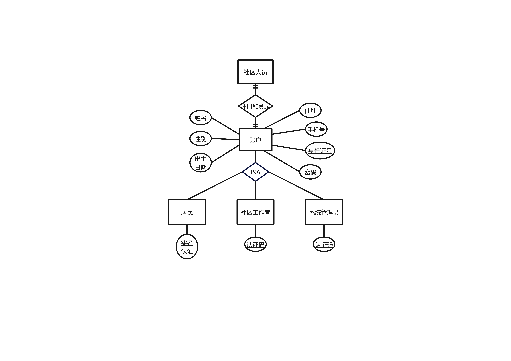

- [结构化需求分析](#结构化需求分析)
  - [数据流图](#数据流图)
    - [上下文图](#上下文图)
    - [0-层图](#0-层图)
    - [1-层图](#1-层图)
  - [E-R图](#e-r图)
- [面向对象建模](#面向对象建模)
  - [用例图](#用例图)
  - [协作图](#协作图)
  - [状态图](#状态图)
  - [顺序图](#顺序图)
- [需求规格文档](#需求规格文档)
- [小组分工](#小组分工)

# 结构化需求分析

## 数据流图

### 上下文图

### 0-层图

### 1-层图

## E-R图

# 面向对象建模

## 用例图

## 协作图

## 状态图

## 顺序图

# 需求规格文档

具体可见[Community-Epidemic-Prevention-and-Control-System / 软件需求规格说明 (社区疫情防控系统)]( https://github.com/maqh1/Community-Epidemic-Prevention-and-Control-System/blob/main/%E8%BD%AF%E4%BB%B6%E9%9C%80%E6%B1%82%E8%A7%84%E6%A0%BC%E8%AF%B4%E6%98%8E(%E7%A4%BE%E5%8C%BA%E7%96%AB%E6%83%85%E9%98%B2%E6%8E%A7%E7%B3%BB%E7%BB%9F).doc)

# 小组分工

- 郑子宇 —— 上下文图，需求规格文档
- 刘钰 —— 0 层图，ppt 制作
- 宋楚齐 —— 1 层图
- 高鹏 —— E-R 图
- 马启浩 —— 用例图、技术博客
- 苏炜 —— 顺序图，协作图，状态图
